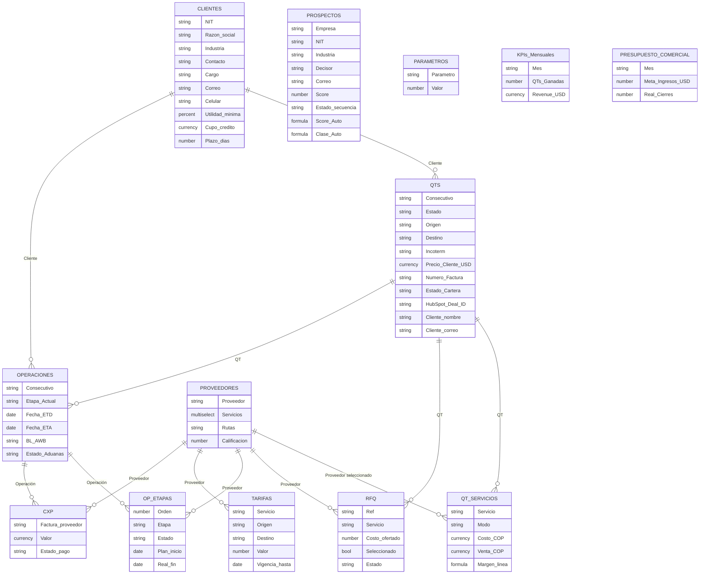
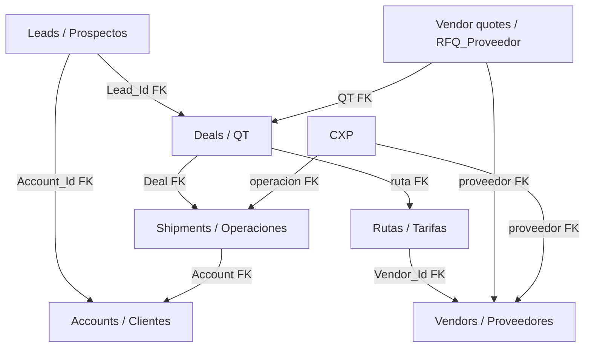
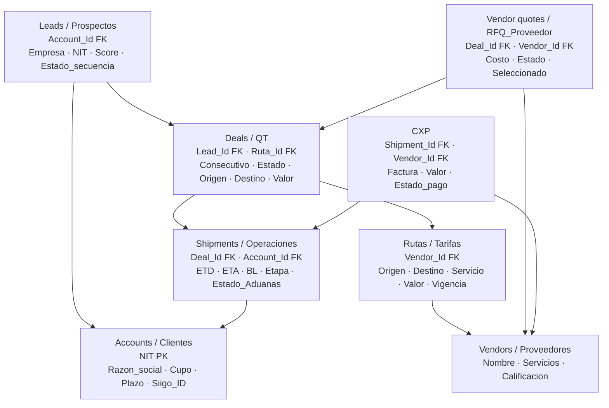

# Modelado de datos: Airtable → Zoho CRM (EASY Logistics)

Guía basada en el esquema real de Airtable (`data.txt`) y en la documentación HTML de EASY OS en esta carpeta.

---

## 1. ¿Los HTML hablan de estas tablas?

**Sí.** La documentación no es un diccionario de campos uno a uno, pero describe el **ciclo de vida del negocio**, qué tabla es fuente de verdad por etapa, y por qué hoy el “CRM” vive en Airtable (no en HubSpot). Eso es la base correcta para modelar en Zoho.

### Mapa explícito: documento → tablas / conceptos


| Documento                               | Tablas / entidades que cubre                                                                                   | Qué encontrarás                                                                                                   |
| --------------------------------------- | -------------------------------------------------------------------------------------------------------------- | ----------------------------------------------------------------------------------------------------------------- |
| `EASY_OS_Arquitectura_Maestra.html`     | PROSPECTOS, QTS (QUOTATIONS), CLIENTES, PROVEEDORES, OPERACIONES, PARAMETROS, KPIs; menciona INVOICES/CONTACTS | Visión E2E, 13 tablas Airtable, flujo de datos (§8), departamentos, ADR-006 (CRM), modelo CGEN+IPT, glosario      |
| `SESION_01_Departamento_Comercial.html` | **PROSPECTOS**, QTS, **PRESUPUESTO_COMERCIAL**, PARAMETROS, CLIENTES                                           | Scoring `Score_Auto` / `Clase_Auto`, estados de secuencia SDR, regla **Prospectos ≠ Clientes**, metas comerciales |
| `SESION_02_Pricing_Cotizaciones.html`   | **QTS**, TARIFAS, CLIENTES, PARAMETROS (margen/TRM)                                                            | RFQ → QT, Pricing Agent, estructura tarifaria, margen EASY                                                        |
| `SESION_03_Proveedores.html`            | **PROVEEDORES**, **TARIFAS**, QTS / OPERACIONES                                                                | Tabla de tarifas (estructura esperada), booking, vigencia de tarifas                                              |
| `SESION_04_Operaciones.html`            | **OPERACIONES** (y lógica de **OP_ETAPAS**)                                                                    | ETD/ETA, BL/AWB, tracking, etapas del embarque, docs                                                              |
| `SESION_05_Aduanas.html`                | Campos aduaneros de OPERACIONES / OP_ETAPAS                                                                    | Aforo, DTA/declaración, documentos DIAN (explica campos como `Estado_Aduanas`, `Fecha_Aforo`, etc.)               |
| `SESION_06_Facturacion.html`            | QTS + CLIENTES + Siigo (no CXP)                                                                                | Factura FV, NIT, CGEN+IPT; hoy parte de facturación vive **dentro de QTS**                                        |
| `SESION_07_Cobranza_Reportes.html`      | QTS (cartera), CLIENTES, PRESUPUESTO / KPIs                                                                    | Estados Facturado→Cobrado, `Fecha_Pago`, DSO, Budget/Sales Manager Agents                                         |


### Lectura recomendada (orden)

1. `EASY_OS_Arquitectura_Maestra.html` — Secciones **3 (E2E)**, **4 (Departamentos)**, **8 (Flujo de Datos)**, **15 (Glosario)**, mención **ADR-006**.
2. `SESION_01` — RN-COM-006 (Prospectos ≠ Clientes) y scoring.
3. `SESION_02` + `SESION_03` — QT / RFQ / tarifas.
4. `SESION_04` + `SESION_05` — operación vs aduanas.
5. `SESION_06` + `SESION_07` — qué **no** debería vivir en el CRM (Siigo = verdad financiera).
6. **Este README §6** — historia E2E Airtable vs Zoho (para alinear al CEO / equipo).

---


## 2. Diagnóstico del modelo actual (por qué duele)

Airtable hoy es a la vez **CRM + OMS (operaciones) + pricing + CxP + BI**. Eso genera redundancia y un “Deal” (QT) que acumula campos de 4 dominios distintos.

### Redundancias claras (desde `data.txt` + docs)


| Problema                                       | Dónde se ve                                                                                          | Impacto                                                               |
| ---------------------------------------------- | ---------------------------------------------------------------------------------------------------- | --------------------------------------------------------------------- |
| Contacto embebido en la empresa                | `CLIENTES` y `PROSPECTOS` tienen Contacto/Cargo/Correo/Celular en la misma fila                      | Un CRM necesita **Account + Contact** separados                       |
| Cliente duplicado en la QT                     | `QTS.Cliente` (link) **y** `Cliente nombre` / `Cliente correo`                                       | Denormalización para Make/email; rompe integridad                     |
| Prospecto vs Cliente sin puente automático     | Doc: migración manual vía Siigo → CLIENTES                                                           | En Zoho: Lead → Contact/Account con conversión formal                 |
| QT = cotización + deal + factura + cartera     | `QTS` tiene precio, HubSpot Deal ID, factura, fechas de pago, `Estado_Cartera`                       | Un módulo CRM no debería ser el libro de CxC                          |
| Operación vs QT                                | `OPERACIONES` + muchos campos de tránsito; doc dice que cobranza también mira estados en QT          | Ciclo de vida mezclado: oportunidad comercial vs expediente operativo |
| RFQ de proveedor vs “RFQ del cliente”          | Tabla `RFQ` = cotizaciones **de proveedores**; el email del cliente también se llama RFQ en los HTML | Homónimos: confundir en Zoho                                          |
| KPIs / presupuesto como tablas transaccionales | `KPIs_Mensuales`, `PRESUPUESTO_COMERCIAL`                                                            | En CRM son **Analytics / metas**, no módulos maestros diarios         |
| Contactos / facturas nombrados en la Maestra   | Docs mencionan INVOICES / CONTACTS; en `data.txt` no aparecen como tablas                            | Drift documental: no migrar “a ciegas” sin inventory real             |


### Lo que el negocio sí necesita (según docs)

Cadena canónica documentada:

```
Prospecto → (califica) → Solicitud embarque → QT → Aprobación → Operación (+ etapas/aduanas)
  → Factura Siigo (CGEN + IPT) → Cobranza → KPI
```

Principios ya escritos en la arquitectura:

- **Airtable = fuente operativa** (hoy).
- **Siigo = fuente financiera** (facturas, CxC oficial).
- **CRM externo (HubSpot) estaba en evaluación (ADR-006)**; el pipeline real vive en Airtable → Zoho puede ocupar ese rol CRM **sin** pretender reemplazar Siigo ni toda la OMS.

---


## 3. Cómo modelar en Zoho CRM (y por qué)


### Principio de separación


| Dominio                                        | ¿Va en Zoho CRM?                                         | ¿Dónde más?                                              |
| ---------------------------------------------- | -------------------------------------------------------- | -------------------------------------------------------- |
| Pipeline comercial (leads, deals, actividades) | **Sí (núcleo)**                                          | —                                                        |
| Cuentas / contactos / vendors                  | **Sí**                                                   | Siigo para datos fiscales del cliente                    |
| Cotización / líneas / RFQ proveedores          | **Parcial** (Deal + Quotes o Custom Modules)             | Airtable/OMS o Creator si la lógica de pricing es pesada |
| Operación logística (ETD, BL, etapas)          | **Opcional / Custom Module “Shipments”** o fuera del CRM | OMS / Airtable / Zoho Creator                            |
| CxP proveedores                                | **Sí (en el modelo objetivo)**                           | Tabla **CXP** linkeada a Shipment + Vendor                               |
| Facturación DIAN                               | **No**                                                   | Siigo                                                    |
| KPIs mensuales                                 | **Dashboards / Analytics**                               | No como “tabla maestra” editable                         |


Zoho CRM no debe ser el clon 1:1 de las 13 tablas. Debe ser el **sistema de relación y pipeline**; el resto se asocia por IDs.

### Mapeo propuesto Airtable → Zoho (modelo objetivo actual)


| Tabla Airtable            | Módulo Zoho / entidad objetivo                          | Notas de modelado                                                                                          |
| ------------------------- | ------------------------------------------------------- | ---------------------------------------------------------------------------------------------------------- |
| **PROSPECTOS**            | **Leads / Prospectos**                                  | Scoring y secuencia. `Account_Id` FK tras Convert (RN-COM-006).                                            |
| **CLIENTES**              | **Accounts / Clientes**                                 | `NIT` PK. Maestro fiscal (paridad Siigo).                                                                  |
| **QTS**                   | **Deals / QT**                                          | Pipeline comercial. `Lead_Id` FK + `Ruta_Id` FK. Sin cartera editable (Siigo).                             |
| **TARIFAS**               | **Rutas / Tarifas**                                     | Catálogo de ruta/tarifa. `Vendor_Id` FK. El Deal referencia la ruta elegida.                               |
| **RFQ**                   | **Vendor_Quotes / RFQ_Proveedor**                       | Ofertas de proveedor. FKs: `Deal_Id` (QT) + `Vendor_Id` (proveedor).                                       |
| **PROVEEDORES**           | **Vendors / Proveedores**                               | Padre de tarifas, RFQs y CXP.                                                                              |
| **OPERACIONES**           | **Shipments / Operaciones**                             | FKs: `Deal_Id` + `Account_Id`. ETD/ETA, BL, aduanas.                                                       |
| **CXP**                   | **CXP**                                                 | FKs: `Shipment_Id` (operacion) + `Vendor_Id` (proveedor).                                                  |
| **QT_SERVICIOS**          | *(fuera de este corte)*                                 | No aparece como tabla en el diagrama objetivo.                                                             |
| **OP_ETAPAS**             | *(fuera de este corte)*                                 | No aparece como tabla en el diagrama objetivo (puede ser estado/subform luego).                            |
| **PARAMETROS**            | Settings / Make                                         | TRM, márgenes.                                                                                             |
| **KPIs / PRESUPUESTO**    | Analytics                                               | No tablas maestras CRM.                                                                                    |


### Modelo objetivo (lógico)

```
Lead ──convierte──► Account
  │                    │
  │ abre               │ cliente de
  ▼                    ▼
Deal (QT) ──ruta──► Rutas/Tarifas ──vendor──► Vendors
  │                                             ▲
  ├── Vendor_Quotes ──proveedor─────────────────┤
  │                                             │
  └── si ganado ──► Shipment                    │
                         ▲                      │
                         │ operacion            │
                        CXP ──proveedor─────────┘
```


### Por qué este corte (no el dump de Airtable)

1. **CRM = personas + pipeline + actividad.** Los docs de Comercial y Pricing definen eso; Operaciones/Aduanas/Facturación son otros sistemas de registro.
2. **Evita el “God object” QT.** Hoy una fila QT mezcla HubSpot Deal ID, precio, factura, cartera y seguimiento comercial. En Zoho el Deal cierra en *Won/Lost*; la factura vive en Siigo; el cobro se refleja por integración o campo de solo lectura.
3. **Respeta RN-COM-006:** Prospecto no es Cliente hasta conversión (hoy vía Siigo; en Zoho vía Lead Convert + sync fiscal).
4. **Homónimos RFQ:** en docs “RFQ” es el email del cliente; en Airtable `RFQ` es oferta del proveedor. En Zoho nombrar `Vendor_Quote` evita el error de diseño.
5. **CGEN + IPT** (Maestra / Facturación) es regla contable colombiana → pertenencia a **Siigo**, no a un layout de Deal.
6. **ADR-006** ya planteaba “¿CRM externo write o Airtable?”. Migrar a Zoho es la Opción A moderna: CRM writeable; Airtable/Creator como OMS si hace falta.
7. **Corte acordado (diagrama nuevo):** 8 entidades — Leads, Accounts, Deals, Shipments, Rutas/Tarifas, Vendors, Vendor_Quotes, CXP. Sin Quote_Lines ni Shipment_Stages como tablas propias.


### Qué migrar primero (fases)


| Fase  | Alcance                                                            | Objetivo                                      |
| ----- | ------------------------------------------------------------------ | --------------------------------------------- |
| **1** | Leads, Accounts, Deals                                             | Pipeline usable                               |
| **2** | Vendors + Rutas/Tarifas + Vendor_Quotes                            | Pricing/proveedores trazable                  |
| **3** | Shipments                                                          | Operaciones visibles sin ensuciar Deals       |
| **4** | CXP + integraciones Siigo / Make                                   | Pago a proveedores + factura cliente          |
| **5** | Analytics (KPIs, presupuesto)                                      | Reportes; retirar tablas snapshot de Airtable |


### Campos de QTS que NO deberían ser el núcleo del Deal

Mover o dejar como lookup / integración:

- `Factura_*`, `Numero_Factura`, `Fecha_Pago_*`, `Estado_Cartera`
- Duplicados `Cliente nombre` / `Cliente correo` (usar Contact)
- `HubSpot Deal ID` → reemplazar por Zoho Deal ID

Mantener en Deal (comercial):

- Consecutivo, fechas solicitud/envío/cierre, Incoterm, origen/destino, descripción, Estado pipeline, utilidad, canal origen, motivo pérdida, valor propuesto, próximo seguimiento.

---


## 4. UML — modelo **actual** (Airtable, as-is)

Diagrama de clases / entidades según relaciones `multipleRecordLinks` en `data.txt`.




### Notas del as-is (para leer el UML)

- **PROSPECTOS** no tiene link formal a CLIENTES ni a QTS en el esquema exportado: el puente es de proceso (email → QT), no de modelo.
- **QTS** concentra dominio comercial + facturación + cartera (olor a diseño CRM incorrecto).
- **PARAMETROS / KPIs / PRESUPUESTO** están aislados (sin FKs): correcto para config/BI, incorrecto tratarlos como entidades CRM iguales a CLIENTES.

---


## 5. UML objetivo (modelo acordado — 8 tablas)

Fuente: diagrama objetivo acordado.  
**En el modelo:** Leads, Accounts, Deals, Shipments, Rutas/Tarifas, Vendors, Vendor_Quotes, CXP.  
**Fuera de este corte:** Contacts (como módulo aparte), Quote_Lines, Shipment_Stages, PARAMETROS, KPIs, PRESUPUESTO.  
Cartera/factura cliente sigue en **Siigo** (ref opcional de solo lectura).

### 5.1 Diagrama de relaciones



Relaciones (10):

| Desde | Campo FK | Hacia | Significado |
|-------|----------|-------|-------------|
| Leads | `Account_Id` | Accounts | convierte a cliente |
| Deals | `Lead_Id` | Leads | QT abierta por el prospecto |
| Deals | `Ruta_Id` | Rutas/Tarifas | ruta/tarifa de la cotizacion |
| Rutas/Tarifas | `Vendor_Id` | Vendors | proveedor de esa tarifa |
| Shipments | `Deal_Id` | Deals | operacion nacida del Deal ganado |
| Shipments | `Account_Id` | Accounts | cliente de la operacion |
| Vendor_Quotes | `Deal_Id` (QT) | Deals | RFQ pedida para esa QT |
| Vendor_Quotes | `Vendor_Id` (proveedor) | Vendors | quien cotizo |
| CXP | `Shipment_Id` (operacion) | Shipments | cuenta por pagar de la OP |
| CXP | `Vendor_Id` (proveedor) | Vendors | a quien se le debe |

### 5.2 Tablas con campos clave (vista esquemática)



### Inventario de FKs por tabla

| Tabla | PK | FKs |
|-------|----|-----|
| **Leads / Prospectos** | (Zoho Lead Id) | `Account_Id` → Accounts |
| **Accounts / Clientes** | `NIT` | — |
| **Deals / QT** | `Consecutivo_QT` | `Lead_Id` → Leads; `Ruta_Id` → Rutas/Tarifas |
| **Shipments / Operaciones** | `Consecutivo_OP` | `Deal_Id` → Deals; `Account_Id` → Accounts |
| **Rutas / Tarifas** | `Tarifa_ID` | `Vendor_Id` → Vendors |
| **Vendors / Proveedores** | `Nombre` / Id | — |
| **Vendor_Quotes / RFQ_Proveedor** | `Ref` | `Deal_Id` → Deals; `Vendor_Id` → Vendors |
| **CXP** | Factura / Id | `Shipment_Id` → Shipments; `Vendor_Id` → Vendors |

### Notas del modelo objetivo

| Qué cambió vs el UML anterior | Decisión |
|------------------------------|----------|
| **Contacts** como tabla propia | Fuera de este corte |
| **Quote_Lines** | Fuera de este corte |
| **Shipment_Stages** | Fuera de este corte |
| **Rate_Cards** | Reemplazado por **Rutas / Tarifas**, linkeada al Deal via `ruta` |
| **CXP** | **Entra** al modelo (antes excluido) |


---


## 6. Historia del ciclo de vida (Airtable hoy → Zoho mañana)

Misma historia de negocio contada dos veces: primero como corre **hoy en Airtable**, después como debería correr **en Zoho CRM**. El objetivo es que cualquiera (incluido el CEO) vea *qué tabla/módulo toca cada momento* y *por qué el modelo nuevo es más claro y seguro*.

> **Semántica crítica (no confundir):**  
> - **RFQ del cliente** = el email donde pide cotización (evento de entrada).  
> - **Tabla `RFQ` / Vendor_Quotes** = cotizaciones *recibidas de proveedores* para armar el precio.  
> No son lo mismo.

---

### 6.1 La historia en una frase

> Encuentro a Importadora Andina → la contacto → me pide un flete → le cotizo (pidiendo precio a proveedores si hace falta) → dice que sí → queda como cliente fiscal → ejecuto el embarque → facturo en Siigo → cobro.

Eso no cambia con Zoho. Lo que cambia es **dónde vive cada pedazo de esa verdad** y que dejen de mezclarse en una sola fila.

---

### 6.2 Modelo actual — Airtable (as-is)

#### El cuento, paso a paso

1. **Aparece un prospecto.** Daniel registra *Importadora Andina* en **`PROSPECTOS`** (empresa, decisor, correo, score). Aún no compra: solo pipeline.
2. **Se le envía correo.** Secuencia SDR / outreach. `Estado_secuencia` avanza (Identificado → En secuencia → Contactado → Respondió → Calificado…). Todo sigue en **`PROSPECTOS`**.
3. **Pide un RFQ (email del cliente).** Escribe origen, destino, carga, peso. Make + Claude crean una fila en **`QTS`** (estado Nuevo / Por cotizar). Aquí nace la *oportunidad* de ese embarque.
4. **Se arma el precio.** Se consultan **`TARIFAS`**, **`PROVEEDORES`**, **`PARAMETROS`** (TRM, margen). Si hace falta pedir precio, se crean filas en la tabla **`RFQ`** (ofertas de proveedores) y líneas en **`QT_SERVICIOS`**.
5. **Se envía la cotización.** Pricing deja la QT cotizada; Daniel aprueba el draft y envía. **`QTS`** pasa a Enviada / Cotizado.
6. **Responde positivamente.** QT → Aprobada / ganada.
7. **Se formaliza el cliente.** Por **RN-COM-006**, el prospecto *no* se convierte solo: Daniel crea/valida en **Siigo** → registro en **`CLIENTES`**, y se linkea a la QT. (`PROSPECTOS` no tiene puente automático a `CLIENTES` ni a `QTS`.)
8. **Se crea la operación.** Nace **`OPERACIONES`** (link a QT + Cliente) y el viaje se descompone en **`OP_ETAPAS`**.
9. **Se ejecuta y se paga al proveedor.** Tracking, aduanas, docs en la operación/etapas. Facturas del carrier van a **`CXP`**.
10. **Se factura y se cobra al cliente.** Siigo emite FV (CGEN + IPT). Hoy parte de cartera también vive *dentro de* **`QTS`** (factura, fechas de pago, `Estado_Cartera`).
11. **Se mide el mes.** **`KPIs_Mensuales`** y **`PRESUPUESTO_COMERCIAL`** miran el agregado (no un solo embarque).

#### Tabla-historia Airtable: momento → tablas → propósito


| # | Momento | Tablas que intervienen | Propósito de esa(s) tabla(s) |
|---|---------|------------------------|------------------------------|
| 1 | Aparece el lead | **PROSPECTOS** | Guardar y priorizar a quien aún no compra |
| 2 | Outreach / secuencia | **PROSPECTOS** (`Estado_secuencia`) | Saber en qué toque va |
| 3 | Email RFQ del cliente | *(Gmail)* → crea **QTS** | Abrir la oportunidad de *este* flete |
| 4 | Conseguir costo | **TARIFAS**, **PROVEEDORES**, **PARAMETROS**, **RFQ**, **QT_SERVICIOS** | Precios vigentes, quién sirve, reglas, ofertas de vendor, líneas de la oferta |
| 5 | Cotización enviada | **QTS** | Constancia de lo ofrecido y el pipeline comercial |
| 6 | Cliente acepta | **QTS** (ganada) | Cerrar la oportunidad a favor |
| 7 | Formalizar cliente | **Siigo** → **CLIENTES** (+ link desde QTS) | Maestro fiscal/comercial estable |
| 8 | Abrir embarque | **OPERACIONES**, **OP_ETAPAS** | Expediente del viaje + hitos |
| 9 | Pagar proveedores | **CXP** | Lo que EASY debe al carrier/agente |
| 10 | Facturar / cobrar | **Siigo** (+ campos cartera en **QTS**) | Ingreso legal DIAN + seguimiento de cobro |
| 11 | Cerrar el mes | **KPIs_Mensuales**, **PRESUPUESTO_COMERCIAL** | Meta vs real, no el caso unitario |

#### Árbol de relaciones (un caso ganado en Airtable)

```
PROSPECTOS          ← cortejo comercial (puede quedar atrás; sin FK formal a QTS/CLIENTES)
      │
      │  email RFQ del cliente (evento; no es la tabla RFQ)
      ▼
CLIENTES  ◄── formalización manual vía Siigo (RN-COM-006)
      │
      ├── QTS  ← "God object": deal + cotización + factura + cartera
      │     ├── QT_SERVICIOS
      │     ├── RFQ  → PROVEEDORES
      │     └── (usa) TARIFAS, PARAMETROS
      │
      └── OPERACIONES
            ├── OP_ETAPAS → PROVEEDORES
            └── CXP → PROVEEDORES
```

#### Dónde duele hoy (para el CEO, en lenguaje de negocio)

| Problema | Qué se siente en el día a día |
|----------|-------------------------------|
| **QT = todo** | Una sola ficha mezcla “¿me van a comprar?”, “¿cuánto cobré?”, “¿pagaron?” y a veces el hilo operativo. Difícil reportar pipeline limpio. |
| **Prospecto ≠ Cliente sin puente** | Hay que recordar el alta en Siigo; se crean QTs sin link a CLIENTES; datos de contacto duplicados en la QT. |
| **Dos “RFQ” distintos** | El equipo habla de RFQ (email del cliente) y existe tabla RFQ (proveedor). Confusión al diseñar automatizaciones y al capacitar. |
| **Airtable = CRM + OMS + CxC + BI** | El “CRM” no es un CRM: es la base de toda la empresa. Escalar o migrar duele porque todo está acoplado. |
| **HubSpot en limbo (ADR-006)** | Pipeline real en Airtable; CRM externo sin deals activos. Decisión a medias. |

---

### 6.3 Modelo objetivo — Zoho CRM (to-be)

Misma historia. Cada pedazo de verdad tiene **un dueño**. Siigo sigue siendo la verdad fiscal. Zoho es relación + pipeline. La operación logística no ensucia el Deal.

#### El mismo cuento, transformado

1. **Aparece un prospecto** → módulo **Leads** (ex-`PROSPECTOS`: score, secuencia, lifecycle).
2. **Se le envía correo** → actividades / campañas / tasks sobre el Lead. Status de secuencia en el Lead.
3. **Pide RFQ por email** → flujo (Make/Zoho) crea un **Deal** ligado al Lead (o al Account si ya existía). Stage: *Por cotizar*. El Deal **es** lo que hoy es la QT comercial (sin factura ni cartera).
4. **Se arma el precio** → **Vendors** + **Rutas/Tarifas** + **Vendor_Quotes** (ex-tabla `RFQ`). El Deal guarda `Ruta_Id`. Parámetros de margen/TRM fuera del CRM o en settings.
5. **Se envía la cotización** → Deal stage *Quote Sent* (+ documento Quote si aplica). Sigue el gate humano (ADR-004: Daniel aprueba el envío).
6. **Responde positivamente** → Deal **Won**. Aquí termina el ciclo *comercial* del embarque.
7. **Se formaliza el cliente** → **Convert Lead** → **Account** (ex-`CLIENTES`). Sync / alta en **Siigo** para facturar. Ya no es un recuerdo manual sin rastro: la conversión es un acto del CRM (RN-COM-006 respetada con puente explícito).
8. **Se crea la operación** → custom **Shipment** (ex-`OPERACIONES`), linkeado al Deal ganado y al Account.
9. **CXP proveedores** → módulo **CXP** (operacion + proveedor). Link a Shipment y Vendor.
10. **Facturar / cobrar** → **Siigo**. En el Deal/Shipment: referencia de factura de solo lectura, no el libro de CxC.
11. **Medir el mes** → **Zoho Analytics** / metas de usuario (no tablas maestras editables tipo KPI en el CRM).

#### Tabla-historia Zoho: momento → módulo → qué reemplaza


| # | Momento | Módulo Zoho | Reemplaza / limpia de Airtable |
|---|---------|-------------|-------------------------------|
| 1 | Aparece el lead | **Leads** | `PROSPECTOS` |
| 2 | Outreach | Leads + Activities / Campaigns | `Estado_secuencia` en la misma fila prospecto |
| 3 | Email RFQ del cliente | Crea **Deal** (+ Contact si ya hay) | Creación de fila `QTS` |
| 4 | Costo proveedores | **Vendors**, **Vendor_Quotes**, **Rutas/Tarifas** | `PROVEEDORES`, `RFQ`, `TARIFAS` |
| 5 | Cotización enviada | Deal stage *Quote Sent* (+ Quotes) | Estado / fechas en `QTS` |
| 6 | Cliente acepta | Deal **Won** | `QTS` ganada |
| 7 | Formalizar cliente | **Convert** → **Account** (+ sync Siigo) | Alta manual Siigo → `CLIENTES` sin puente desde prospecto |
| 8 | Abrir embarque | **Shipment** | `OPERACIONES` |
| 9 | Pagar proveedores | **CXP** | `CXP` (ahora dentro del modelo objetivo) |
| 10 | Facturar / cobrar | **Siigo** (ref opcional en CRM) | Campos factura/cartera **fuera** del Deal (dejan de vivir en `QTS`) |
| 11 | Cerrar el mes | Analytics / metas | `KPIs_Mensuales`, `PRESUPUESTO_COMERCIAL` |

#### Árbol de relaciones (mismo caso en Zoho)

```
Lead ──convert──► Account
  │                  │
  │ abre             │ cliente
  ▼                  ▼
Deal (QT) ──ruta──► Rutas/Tarifas ──► Vendors
  │                                    ▲
  ├── Vendor_Quotes ──proveedor────────┤
  │                                    │
  └── Shipment (si Won)                │
         ▲                             │
         └── CXP ──proveedor───────────┘
```

#### Transformación lado a lado (la misma Andina)


| Momento | Hoy (Airtable) | Mañana (Zoho) | Por qué es mejor |
|---------|----------------|---------------|------------------|
| Cortejo | Fila en `PROSPECTOS` | **Lead** | Pipeline de leads estándar; scoring y secuencia sin mezclar clientes |
| Pide flete | Se crea `QTS` (a veces sin cliente linkeado) | Se crea **Deal** bajo Lead/Account | Toda oportunidad tiene dueño (cuenta/contacto) |
| Cotizar con vendors | Tabla `RFQ` + `QT_SERVICIOS` colgadas de QTS | **Vendor_Quotes** + **Rutas/Tarifas** del Deal | Nombre claro: RFQ = proveedor; Deal = oportunidad |
| Enviar cotización | Campos y estado dentro de la misma QTS “gorda” | Stage del Deal | Reportes de *cotizado vs ganado* sin filtrar ruido de factura |
| Acepta | QTS ganada | Deal **Won** | Cierre comercial explícito; no se confunde con “ya facturé” |
| Es cliente | Alta Siigo → `CLIENTES` (manual, RN-COM-006) | **Convert Lead** → Account + Siigo | Puente formal; menos duplicados |
| Ejecutar flete | `OPERACIONES` (+ a veces mirada a estados en QTS) | **Shipment** aparte del Deal | Comercial ve deals; operaciones ve embarques |
| Pagar proveedor | `CXP` en Airtable | **CXP** en el modelo (OP + Vendor) | Visible junto a la operación |
| Cobrar | Cartera dentro de `QTS` + Siigo | Solo **Siigo** (+ ref) | Una sola verdad de plata; el CRM no finge ser contabilidad |
| Decisión CRM | HubSpot read-only / ADR-006 abierto | Zoho como CRM writeable | Cierra ADR-006: el pipeline vive donde se trabaja |

---

### 6.4 Por qué el modelo nuevo es mejor (mensaje para el CEO)

1. **Una pregunta = un lugar.**  
   *¿Cómo va el pipeline?* → Deals. *¿Quién es el cliente?* → Accounts. *¿Dónde va el contenedor?* → Shipments. *¿Pagaron?* → Siigo. Hoy casi todo se responde abriendo la misma QT.

2. **Menos errores operativos.**  
   Deja de haber “QT sin cliente”, contacto copiado tres veces, y confusión RFQ-cliente vs RFQ-proveedor. Las automatizaciones (Make) se enganchan a eventos claros: Lead convertido, Deal Won, Shipment creado.

3. **Escala con una sola persona supervisando.**  
   El diseño actual obliga a que Daniel sea la memoria del sistema (cuándo pasar a CLIENTES, qué campos de la QT mirar). Zoho hace visible el ciclo: Lead → Account → Deal → Won → Shipment.

4. **No se reemplaza lo que ya funciona en finanzas.**  
   Siigo sigue siendo DIAN / CxC. Zoho no intenta ser ERP. Se elimina el riesgo de “actualizar la cartera en Airtable y olvidar Siigo” (o al revés).

5. **Reportes que sí sirven para dirigir.**  
   Metas tipo 15 QTs / 3 cierres / 10 prospectos se leen natural sobre Leads y Deals, no sobre una tabla que también guarda facturas y pagos.

6. **Migración por fases, sin apagar Airtable de golpe.**  
   Fase 1: Leads + Accounts + Contacts + Deals.  
   Fase 2: Vendors + Vendor_Quotes + líneas.  
   Fase 3: Shipments.  
   Fase 4: Siigo sync.  
   Fase 5: Analytics y retiro de KPIs/presupuesto como tablas transaccionales.  
   El negocio sigue; el modelo se limpia por capas.

**En una línea:** Zoho no cambia *qué hace* EASY (prospectar → cotizar → operar → facturar → cobrar); cambia *dónde vive cada verdad* para que el CEO vea el negocio sin abrir una QT que es a la vez CRM, cotización, factura y cobro.

---


## 7. Fuentes en esta carpeta


| Archivo                             | Rol                                                         |
| ----------------------------------- | ----------------------------------------------------------- |
| `data.txt`                          | Inventario de tablas/campos Airtable (fuente del UML as-is) |
| `EASY_OS_Arquitectura_Maestra.html` | Arquitectura y flujo de datos                               |
| `SESION_01` … `SESION_07`           | Semántica por departamento                                  |
| Este README                         | Criterios de modelado hacia Zoho + historia E2E as-is/to-be |


---


## 8. Conclusión práctica

La documentación **sí** habla de estas tablas, sobre todo como **actores del proceso** (no como ERD formal). El patrón de negocio es claro: **prospecto → QT → operación → Siigo → cobro**.

Para Zoho: modela **Leads / Accounts / Deals / Vendors / Rutas-Tarifas / Vendor_Quotes / Shipments / CXP** según el diagrama objetivo; en este corte no hay Quote_Lines ni Shipment_Stages como tablas propias; facturación DIAN sigue en Siigo; KPIs/presupuesto van a Analytics.

La **sección 6** cuenta esa misma cadena como historia en Airtable y en Zoho: sirve para alinear al equipo y al CEO en *por qué* migrar — no porque el negocio cambie, sino porque hoy una sola fila QT mezcla cuatro dominios, y el modelo nuevo le da a cada dominio su sitio. Así eliminas la redundancia que hace que QTS y CLIENTES/PROSPECTOS no respondan bien a un CRM.